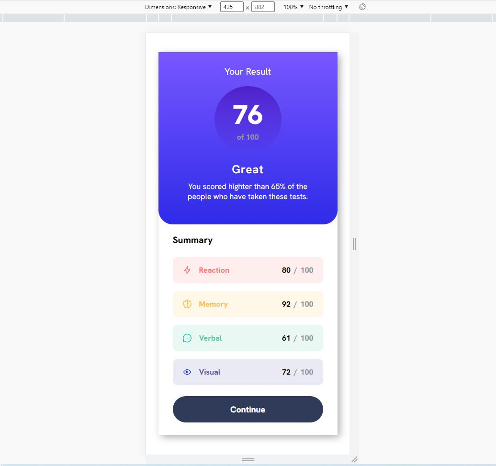
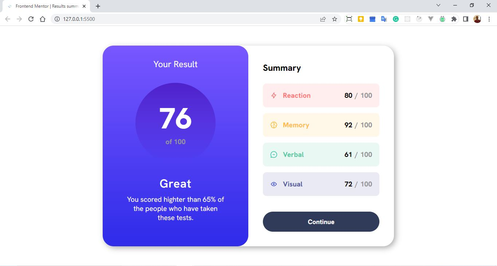

# Frontend Mentor - Results summary component solution

This is a solution to the [Results summary component challenge on Frontend Mentor](https://www.frontendmentor.io/challenges/results-summary-component-CE_K6s0maV). Frontend Mentor challenges help you improve your coding skills by building realistic projects.

## Table of contents

- [Overview](#overview)
  - [The challenge](#the-challenge)
  - [Screenshot](#screenshot)
  - [Links](#links)
- [My process](#my-process)
  - [Built with](#built-with)
  - [What I learned](#what-i-learned)
  - [Continued development](#continued-development)
  - [Useful resources](#useful-resources)
- [Author](#author)
- [Acknowledgments](#acknowledgments)

## Overview

### The challenge

Users should be able to:

- View the optimal layout for the interface depending on their device's screen size
- See hover and focus states for all interactive elements on the page

### Screenshot

### Links

- [Solution URL](https://github.com/fernastereo/FEM-Results-summary-component)
- [Live Site URL](https://fernastereo.github.io/FEM-Results-summary-component/)

## My process

- Create the markup in html for whole component.
- Add the markup in html for left(up) component
- Create a css file and add the styles for this component.
- Add the markup in html for right(down) component
- Add the styles for this component.
- Add the styles for desktop breakpoint.

### Built with

- Semantic HTML5 markup
- CSS custom properties
- Flexbox
- Mobile-first workflow

### What I learned

How to make shadows and gradients.

### Useful resources

- [Box Shadow generator](https://html-css-js.com/css/generator/box-shadow/) - This helped me to generate and understand shadows and gradients in objects.

## Author

- Website - [Fernando Cueto](https://www.fernandocueto.com)
- Frontend Mentor - [@fernastereo](https://www.frontendmentor.io/profile/fernastereo)
- Twitter - [@fernastereo](https://www.twitter.com/fernastereo)
